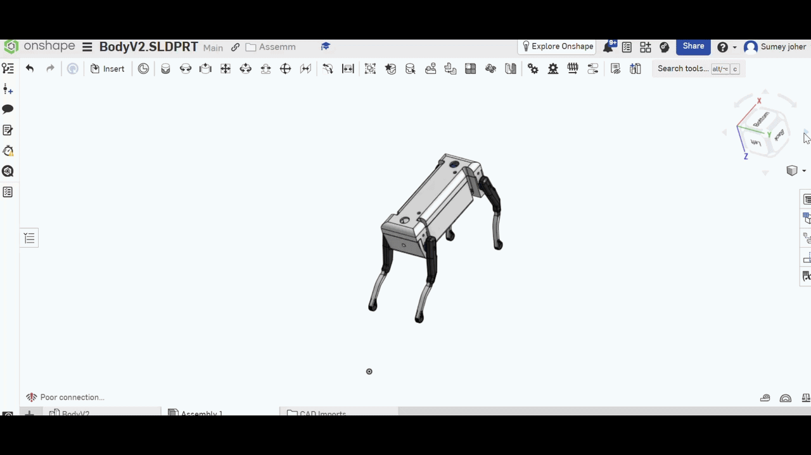

# 🤖 Project Assembly & Exploded View (Onshape)
# 🟡& Robot building logarithm🟠

Welcome to the technical documentation of the assembly and mechanical design structure. This repository outlines the joint configurations and explosion steps implemented in Onshape.
---

## 🔗 Live CAD Model Access

You can view, inspect, and test the assembly and exploded views of the live Onshape model through the link below:
[https://cad.onshape.com/documents/bd7a0bea55eea93531941c04/w/a3c836c2a17439c7137bd585/e/96fb98fe7ebec88bf06825f1]
---

  

---
## ⚙️ Assembly Mates Overview
* **Planar Mate:** Restricts parts to a 2D plane, providing 3 degrees of freedom (2 linear translations along X/Y and 1 rotation around the normal Z-axis). Perfect for sliding components.
* **Fastened & Mechanical Mates:** Used to lock components completely or simulate precise hinges and sliders.
* **Multi-Surface Parallelism:** Achieved by referencing master datum planes or aligning connectors sequentially to avoid over-constraints.

---

## 💥 Exploded Views & Animation Workflow
* **Explode Steps:** Parts are separated into structured individual steps (`Explode step 1`, `Explode step 2`, etc.) to control the sequence and timing of the disassembly.
* **Animation & Recording:** Since Onshape renders exploded views statically for drafting and inspection, real-time screen capture tools are utilized during the explode-collapse preview to generate demonstration videos. Speed and pacing can be further adjusted using external video editors.

---

# 🤖 New Robot Design & Engineering Algorithm🟡🟠

### 1. Defining Actuator & Motor Types & Count
Since the robot has a relatively large mass (12-14 kg) and a robust structure, small hobby motors cannot be relied upon. Motors must be divided into two main categories:

*   **Joints & Arms (Precision Movement):**
    *   **Type:** High-Torque Smart Bus Servos 🦾
    *   **Count:** Proportional to the degrees of freedom (12 to 14 DOF), allocating 5 to 6 motors per arm, with the rest dedicated to directing the head or upper base 🧠
*   **Mobility Base:**
    *   **Type:** Motors equipped with gearboxes to ensure high torque and the ability to withstand the heavy body weight ⚙️
    *   **Count:** 2 main motors 🚗

---

### 2. Balance & Stability Control Strategy
Given the robot's width (50-70 cm) and height (30-40 cm), mass distribution plays a fundamental role in balance:

*   **Low Center of Gravity:** Positioning heavy components, such as heavy batteries and the power system, at the very bottom of the robot's base to lower the center of gravity and prevent tipping over ⚖️.

---

### 3. Kinematics & Smooth Motion
*   **Advanced Arm Movement:** Utilizing Forward & Inverse Kinematics algorithms to accurately calculate joint angles and avoid kinematic singularities 📐.
*   **Friction Reduction Mechanism:** Using ball bearings in the main arm joints to reduce mechanical friction and extend motor lifespan 🔄.

---

### 4. Electronic Architecture Design
The electronic system requires a distributed structure to prevent overloading a single processor:

*   **Main Controller:** Using a powerful single-board computer like a Raspberry Pi 5 or NVIDIA Jetson Nano for heavy data processing, computer vision, and decision-making 💻.
*   **Power Distribution Board (PDB):** Regulating voltage and separating high-consumption motor power lines from sensor and processor power lines to prevent electrical noise ⚡.

---

### 5. Sensor Suite
For the robot to operate efficiently, it relies on the integration of multiple sensors:

*   **Encoders (Position & Speed Sensors):** Built into the motors to precisely track wheel and arm rotations 📏.
*   **LiDAR / Ultrasonic (Proximity & Distance Sensors):** To map the surrounding environment and accurately detect obstacles with a horizontal resolution matching the robot's width (50-70 cm) 📡.

---

### 6. Payload & Torque Analysis
*   **Required Joint Torque Formula:** 
    `Torque = Force × Distance`
    It is necessary to calculate the maximum length of the robot's arm (e.g., 30 cm) alongside the maximum proposed payload capacity for the hand (e.g., lifting a 1-2 kg object) 🏋️‍♂️.

---

### 7. Wheel Base Load Capacity
The base is designed to support the robot's total structural weight (14 kg); therefore, the wheel motor capacity must be balanced to drive this weight on slight inclines, choosing motors with sufficient stall torque matching the upper body mass to prevent burnout or sudden stalling under pressure 🛠️.

